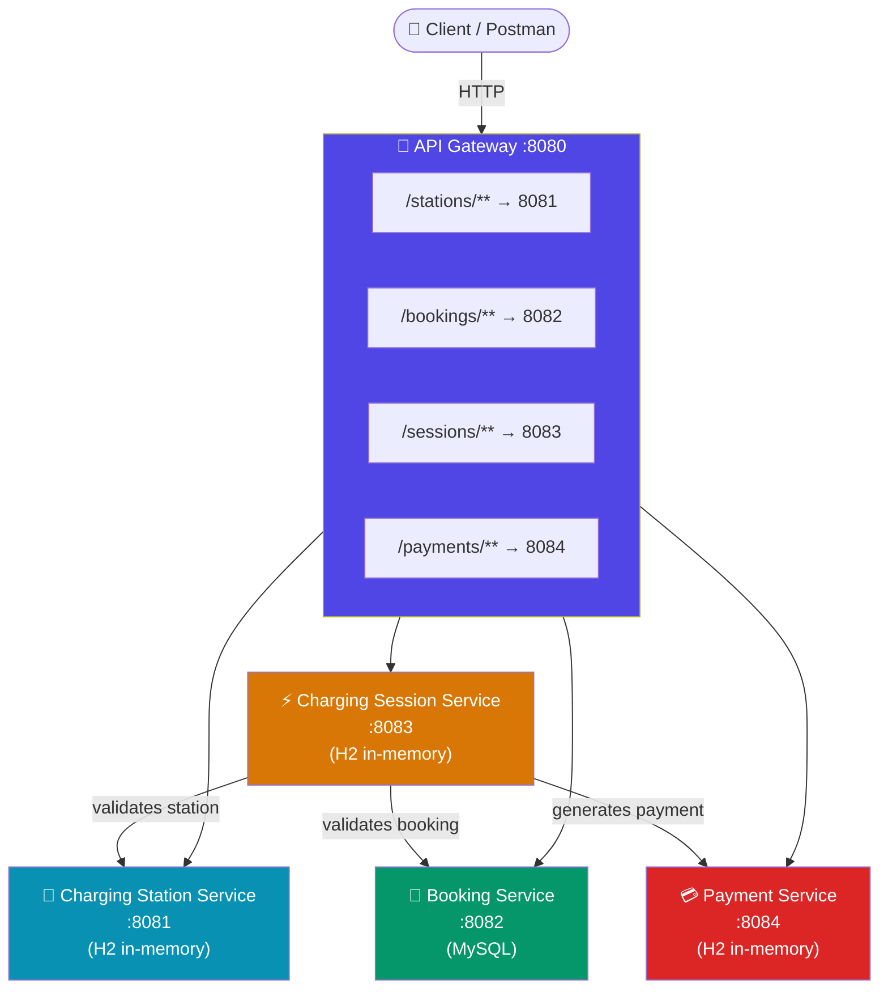
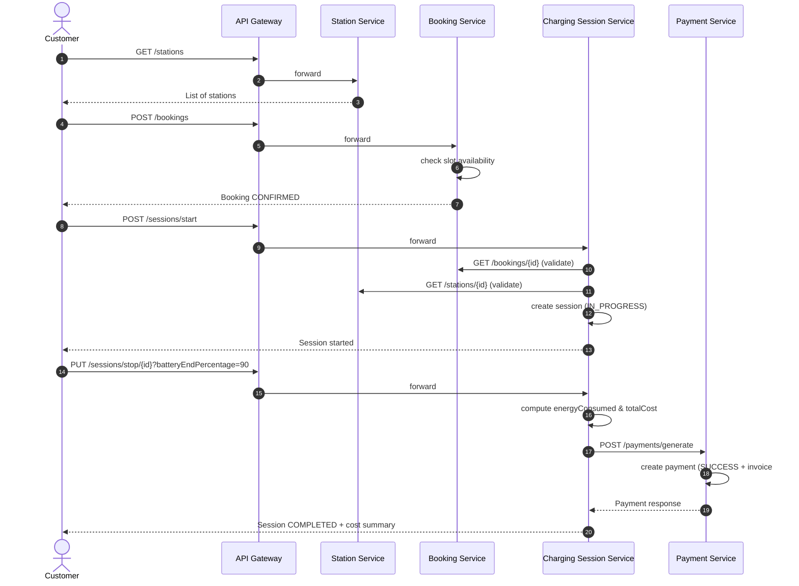
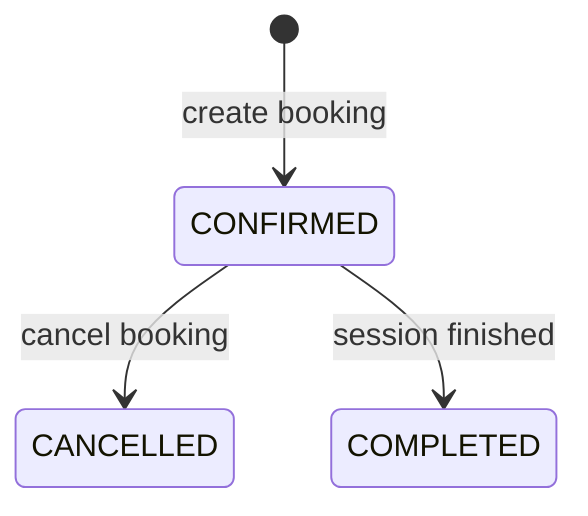
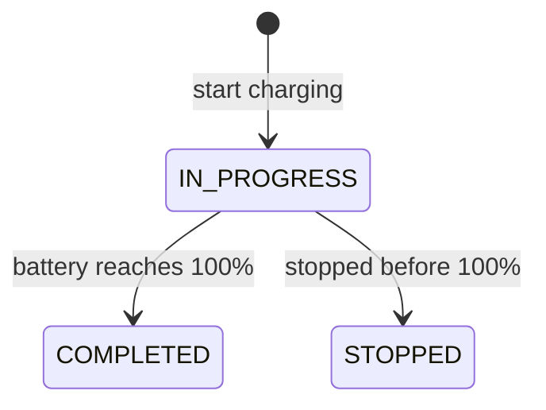

# ⚡ EV Charging Platform — Microservices Backend

A Spring Boot microservices system that lets a customer **find a charging station, book a slot, run a charging session, and pay for the energy consumed** — all orchestrated behind a single API Gateway.


---

## 📖 Table of Contents

1. [Overview](#-overview)
2. [Architecture](#-architecture)
3. [Services](#-services)
4. [End-to-End Flow](#-end-to-end-flow)
5. [Tech Stack](#-tech-stack)
6. [Project Structure](#-project-structure)
7. [Getting Started](#-getting-started)
8. [API Reference](#-api-reference)
9. [Postman Collection](#-postman-collection--sample-requests)
10. [Known Issues & Improvements](#-known-issues--improvements)
11. [Roadmap](#-roadmap)

---

## 🧭 Overview

This project simulates a real-world **EV charging network** built as independently deployable Spring Boot microservices, fronted by a **Spring Cloud API Gateway**. Each service owns its own data and exposes a REST API; services talk to each other synchronously over HTTP (`RestTemplate`) to complete a booking → charge → pay workflow.

| Capability | Service |
|---|---|
| Route all client traffic | **API Gateway** |
| Manage charging stations (CRUD) | **Charging Station Service** |
| Reserve a time slot at a station | **Booking Service** |
| Start/stop a charging session, compute energy usage & cost | **Charging Session Service** |
| Record and confirm payment for a session | **Payment Service** |

---

## 🏗 Architecture



**Key idea:** the **Charging Session Service** is the orchestrator — when a session starts, it calls the Booking and Station services to validate; when a session stops, it calculates energy/cost and calls the Payment Service to generate the invoice.

---

## 🧩 Services

| # | Service | Port | Base Path | Database | Responsibility |
|---|---------|------|-----------|----------|-----------------|
| 1 | **ApiGateway** | `8080` | — | — | Single entry point; routes requests to downstream services using `spring-cloud-starter-gateway` |
| 2 | **ChargingStationService** | `8081` | `/stations` | H2 (`chargingstationdb`) | CRUD for charging stations (name, city, location, connector type, speed, slots, status) |
| 3 | **BookingService** | `8082` | `/bookings` | MySQL (`booking_db`) | Creates/cancels bookings, prevents double-booking of the same station/date/time |
| 4 | **chargingSession** | `8083` | `/sessions` | H2 (`chargingsessiondb`) | Starts/stops sessions, calculates energy consumed & cost, triggers payment |
| 5 | **PaymentService** | `8084` | `/api/payments` | H2 (`paymentdb`) | Generates payment records with invoice numbers, tracks payment status |

---

## 🔄 End-to-End Flow



### Booking state machine



### Charging session state machine



---

## 🛠 Tech Stack

- **Language:** Java 17
- **Framework:** Spring Boot 3.5.4 / Spring Cloud Gateway
- **Data:** Spring Data JPA, H2 (in-memory), MySQL (Booking Service)
- **Validation:** Jakarta Bean Validation (`@NotBlank`, `@Positive`, `@Email`, etc.)
- **Boilerplate reduction:** Lombok
- **Inter-service communication:** `RestTemplate` (synchronous HTTP)
- **Build tool:** Maven
- **API testing:** Postman / cURL

---

## 📁 Project Structure

```
ev-charging-platform/
├── ApiGateway/                   # Spring Cloud Gateway – single entry point (8080)
├── ChargingStationService/       # Station CRUD (8081)
├── BookingService/               # Slot booking & availability (8082)
├── chargingSession/              # Session lifecycle & cost engine (8083)
└── PaymentService/               # Payment & invoicing (8084)
```

Each service follows the same layered layout:

```
src/main/java/com/skillfirstlab/<service>/
├── controller/     # REST endpoints
├── service/        # Business logic
├── repository/     # Spring Data repositories
├── entity/         # JPA entities
├── dto/            # Request / response DTOs
├── enums/          # Status & type enums
└── exception/      # Custom exceptions + @RestControllerAdvice handler
```

---

## 🚀 Getting Started

### Prerequisites

- Java 17+
- Maven 3.8+
- MySQL 8 running locally (for Booking Service) — create the schema:
  ```sql
  CREATE DATABASE booking_db;
  ```
- Ports `8080–8084` free on `localhost`

### Run order

Start services in this order so downstream calls succeed (Booking + Station must be up before starting a session; Payment must be up before stopping one):

```bash
# 1) Charging Station Service
cd ChargingStationService && ./mvnw spring-boot:run

# 2) Booking Service
cd BookingService && ./mvnw spring-boot:run

# 3) Payment Service
cd PaymentService && ./mvnw spring-boot:run

# 4) Charging Session Service
cd chargingSession && ./mvnw spring-boot:run

# 5) API Gateway (start last)
cd ApiGateway && ./mvnw spring-boot:run
```

Once all five are up, everything can be accessed through the gateway at:

```
http://localhost:8080
```

Each service also exposes an H2 console (except Booking, which uses MySQL) at `/h2-console` on its own port, e.g. `http://localhost:8081/h2-console`.

---

## 📡 API Reference

### 🔌 Charging Station Service — `/stations`

| Method | Endpoint | Description |
|--------|----------|--------------|
| `POST` | `/stations` | Add a new charging station |
| `GET` | `/stations` | List all stations |
| `GET` | `/stations/{id}` | Get station by ID |
| `PUT` | `/stations/{id}` | Update a station |
| `DELETE` | `/stations/{id}` | Delete a station |

### 📅 Booking Service — `/bookings`

| Method | Endpoint | Description |
|--------|----------|--------------|
| `POST` | `/bookings` | Create a booking (rejects if slot already taken) |
| `GET` | `/bookings/{id}` | Get a booking by ID |
| `PUT` | `/bookings/{id}/cancel` | Cancel a booking |

### ⚡ Charging Session Service — `/sessions`

| Method | Endpoint | Description |
|--------|----------|--------------|
| `POST` | `/sessions/start` | Start a session (validates booking + station) |
| `PUT` | `/sessions/stop/{sessionId}?batteryEndPercentage=` | Stop a session, compute cost, trigger payment |
| `GET` | `/sessions/{sessionId}` | Get a session by ID |
| `GET` | `/sessions` | List all sessions |
| `DELETE` | `/sessions/{sessionId}` | Delete a session |

### 💳 Payment Service — `/api/payments`

| Method | Endpoint | Description |
|--------|----------|--------------|
| `POST` | `/payments/generate` | Generate a payment record |
| `GET` | `/payments/{paymentId}` | Get a payment by ID |
| `GET` | `/payments` | List all payments |
| `DELETE` | `/payments/{paymentId}` | Delete a payment |


---

## 📬 Postman Collection / Sample Requests

All requests below go through the **API Gateway** (`http://localhost:8080`) unless noted otherwise. Import these as a Postman collection, or run the `curl` commands directly.

### 1. Create a charging station

```bash
curl -X POST http://localhost:8080/stations \
  -H "Content-Type: application/json" \
  -d '{
    "stationName": "GreenCharge Hub",
    "city": "Chennai",
    "location": "OMR Road",
    "connectorType": "CCS2",
    "chargingSpeed": 60.0,
    "availableSlots": 4,
    "stationStatus": "ACTIVE"
  }'
```

### 2. Get all stations

```bash
curl -X GET http://localhost:8080/stations
```

### 3. Get station by ID

```bash
curl -X GET http://localhost:8080/stations/1
```

### 4. Update a station

```bash
curl -X PUT http://localhost:8080/stations/1 \
  -H "Content-Type: application/json" \
  -d '{
    "stationName": "GreenCharge Hub - Updated",
    "city": "Chennai",
    "location": "OMR Road",
    "connectorType": "CCS2",
    "chargingSpeed": 90.0,
    "availableSlots": 6,
    "stationStatus": "ACTIVE"
  }'
```

### 5. Delete a station

```bash
curl -X DELETE http://localhost:8080/stations/1
```

### 6. Create a booking

```bash
curl -X POST http://localhost:8080/bookings \
  -H "Content-Type: application/json" \
  -d '{
    "customerName": "Ashwin",
    "email": "ash76@example.com",
    "mobile": "9876543210",
    "stationId": 1,
    "bookingDate": "2026-07-25",
    "bookingTime": "10:30:00"
  }'
```

### 7. Get booking by ID

```bash
curl -X GET http://localhost:8080/bookings/1
```

### 8. Cancel a booking

```bash
curl -X PUT http://localhost:8080/bookings/1/cancel
```

### 9. Start a charging session

```bash
curl -X POST http://localhost:8080/sessions/start \
  -H "Content-Type: application/json" \
  -d '{
    "bookingId": 1,
    "stationId": 1,
    "customerId": 101,
    "connectorType": "CCS2",
    "batteryStartPercentage": 20,
    "batteryCapacity": 40.0
  }'
```

### 10. Stop a charging session

```bash
curl -X PUT "http://localhost:8080/sessions/stop/1
```

### 11. Get session by ID

```bash
curl -X GET http://localhost:8080/sessions/1
```

### 12. Get all sessions

```bash
curl -X GET http://localhost:8080/sessions
```

### 13. Generate a payment (direct — see known issue on gateway routing)

```bash
curl -X POST http://localhost:8084/payments/generate \
  -H "Content-Type: application/json" \
  -d '{
    "sessionId": 1,
    "customerId": 101,
    "amount": 420.50,
    "paymentMethod": "UPI"
  }'
```

### 14. Get payment by ID

```bash
curl -X GET http://localhost:8084/payments/1
```

### 15. Get all payments

```bash
curl -X GET http://localhost:8084/payments
```


---

## 🐞 Known Issues & Improvements

These are real gaps found while reviewing the codebase — worth fixing before a production rollout:

| Area | Issue | Suggested Fix |
|------|-------|----------------|
| **Gateway ↔ Payment routing** | Gateway routes `/payments/**` to port `8084`, but `PaymentController` is mapped at `/api/payments`, and the Charging Session Service calls `http://localhost:8084/payments/generate` (missing `/api` prefix) | Standardize on one base path (`/payments` everywhere) across the gateway route, controller `@RequestMapping`, and the internal `RestTemplate` call |
| **Booking entity annotations** | `BookingService`'s `entity` package defines its **own** `@Entity` and `@GeneratedValue` annotations, which shadow the real `jakarta.persistence` ones — so `Booking` is not actually managed as a JPA entity with auto ID generation | Remove the custom `Entity.java` / `GeneratedValue.java` files and import `jakarta.persistence.Entity` / `GenerationType.IDENTITY` directly |
| **Service discovery** | All inter-service URLs are hardcoded (`localhost:8081`, etc.) | Introduce **Eureka / Consul** for service discovery instead of hardcoded hosts |
| **Resilience** | No retries, circuit breakers, or timeouts on the `RestTemplate` calls between Session → Booking/Station/Payment | Add **Resilience4j** (circuit breaker + retry) around inter-service calls |
| **Security** | No authentication/authorization on any endpoint | Add JWT-based auth at the API Gateway (Spring Cloud Gateway filter) |
| **Config duplication** | H2 console properties left over in `BookingService` even though it uses MySQL | Clean up unused `application.properties` entries |
| **Async communication** | Session → Payment call is synchronous and blocking | Consider Kafka/RabbitMQ events for payment generation to decouple services |

---


## Output
### Postman
### ChargingStationService

### BookingServive

### ChargingSessionService


### PaymentService


### H2 Console


